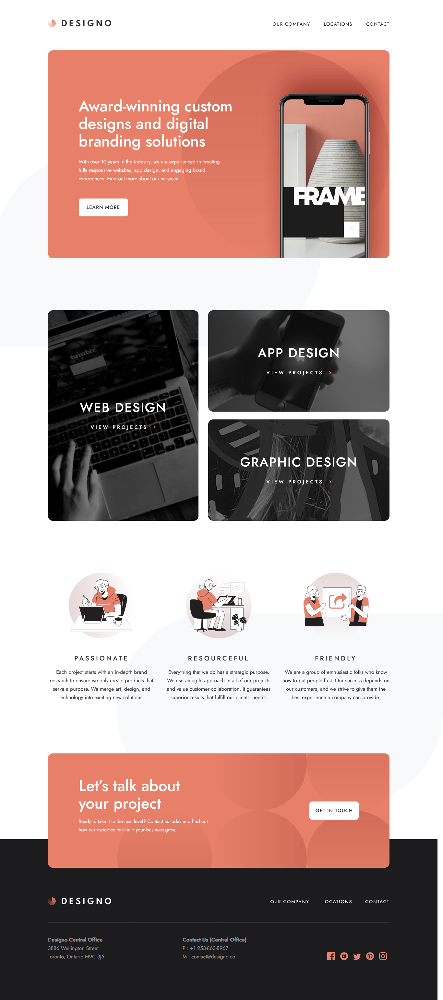

# Frontend Mentor - Designo agency website solution

This is a solution to the [Designo agency website challenge on Frontend Mentor](https://www.frontendmentor.io/challenges/designo-multipage-website-G48K6rfUT). Frontend Mentor challenges help you improve your coding skills by building realistic projects. 

## Table of contents

- [Frontend Mentor - Designo agency website solution](#frontend-mentor---designo-agency-website-solution)
  - [Table of contents](#table-of-contents)
  - [Overview](#overview)
    - [The challenge](#the-challenge)
    - [Screenshot](#screenshot)
    - [Links](#links)
  - [My process](#my-process)
    - [Built with](#built-with)
  - [Author](#author)

## Overview

### The challenge

Users should be able to:

- View the optimal layout for each page depending on their device's screen size
- See hover states for all interactive elements throughout the site
- Receive an error message when the contact form is submitted if:
  - The `Name`, `Email Address` or `Your Message` fields are empty should show "Can't be empty"
  - The `Email Address` is not formatted correctly should show "Please use a valid email address"
- **Bonus**: View actual locations on the locations page maps (we recommend [Leaflet JS](https://leafletjs.com/) for this)

### Screenshot

### Links

- Solution URL: (https://github.com/Gzeven/designo)
- Live Site URL: (https://designo-webdesign.netlify.app/)

## My process

### Built with

- HTML5
- CSS custom properties
- Mapbox(https://www.mapbox.com/)
- React Router Dom(https://reactrouter.com/web/guides/quick-start)
- React Router Hash Link(https://www.npmjs.com/package/react-router-hash-link)
- Animated hamburger menu icons(https://hamburger-react.netlify.app/)
- CSS Grid and Flexbox
- Mobile-first workflow
- [React](https://reactjs.org/) - JS library
- [Styled Components](https://styled-components.com/) - For styles

## Author

- Frontend Mentor - [@Gzeven](https://www.frontendmentor.io/profile/Gzeven)

